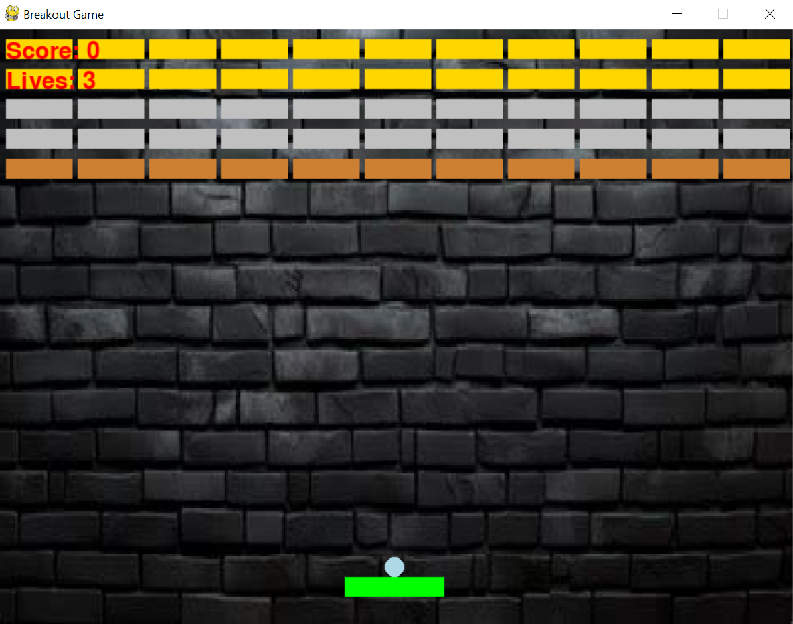
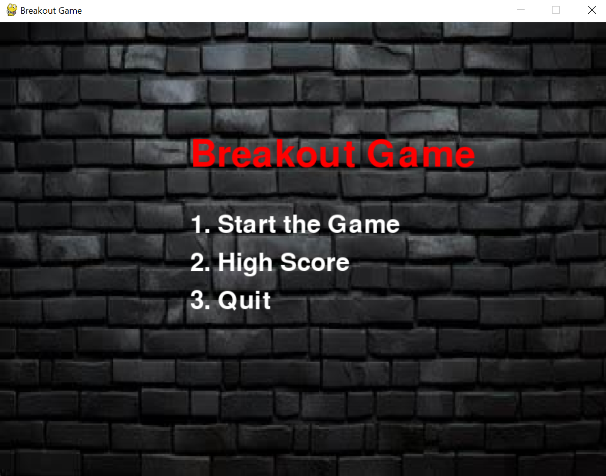
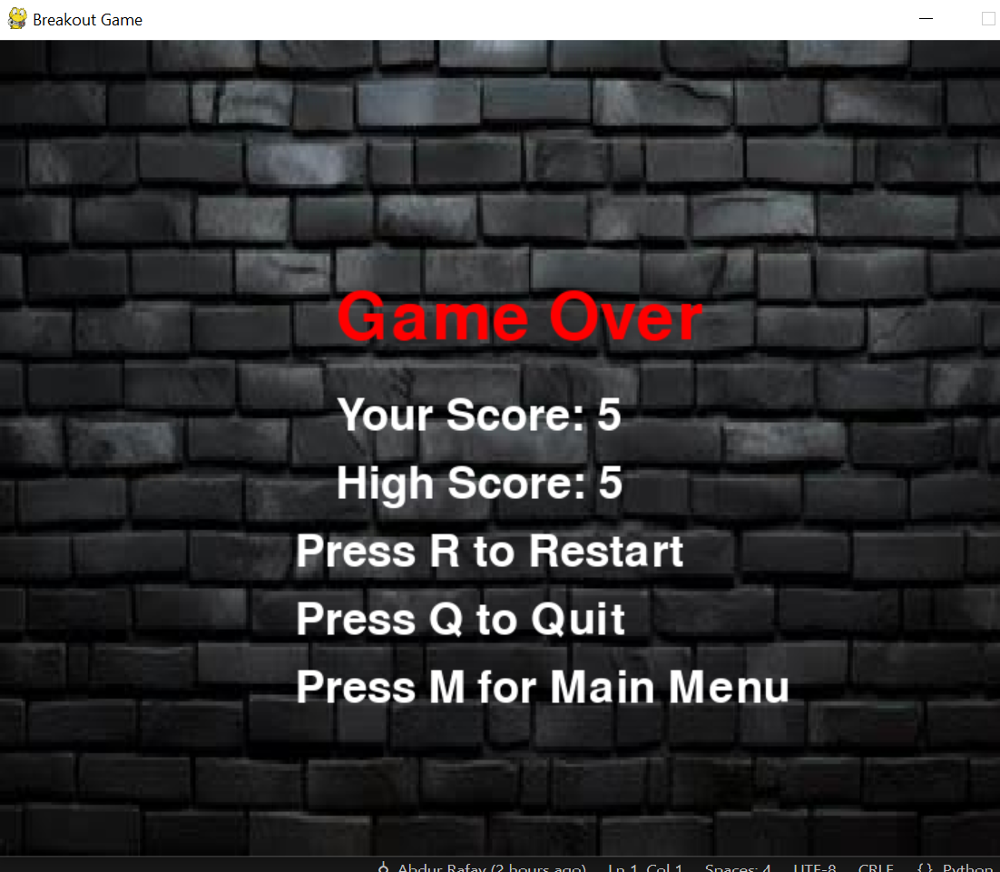

# breakout
# Breakout Game 🎮

This is a classic **Breakout-style arcade game** built using Python and Pygame.

## 🎯 Features
- Ball and paddle gameplay
- Colorful bricks that break on impact
- Extra lives (heart drops) on brick hit
- High score saving to file
- Smooth animation and sound

## 🛠️ How to Run

1. Make sure you have Python installed.
2. Install Pygame:
pip install pygame
3. Run the game:

## 📂 Files
- `ball.py`: Main game logic
- `heart.png`: Image for extra lives
- `high_score.txt`: Stores high score
- `README.md`: This file

## 👨‍💻 Author
- Abdur Rafay Hassan Baloch

## 📸 Screenshot

Enjoy the game!

